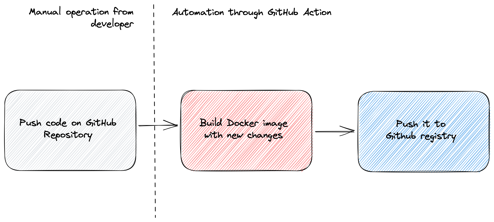

# Image process

Explains how Megalotron images' are built and used in production.

## GitHub Registry

Megalotron use its [organisation's registry](https://github.com/orgs/Megalotron/packages) to host Docker Image.

We could use other solution like [Docker Hub](https://hub.docker.com) or [ECR](https://hub.docker.com) but
it is more convenient to reduce the number of services used.

## Process



:::note

Each repository has credentials to push to Megalotron GitHub repository.

Password is stored as a secret named `REGISTRY_TOKEN` and the username is
stored as `REGISTRY_USERNAME`.

:::

## Image convention

Megalotron has multiple stack, to simplify its management, there's a semantic convention to follow.

- **An image shall be named following the convention** `megalotron/<stack>:<tag>`.
- **Tag shall follow the [official semantic versioning](https://semver.org)**.
- **New release shall have a newer version than the previous one**: `v1.0.0` -> `v1.0.1`.
- **Production and develop version shall respectively be named `main` and `dev`**.

## Image name by stack

| Stack                                                      | Tag                        |
|------------------------------------------------------------|----------------------------|
| [Dashboard](https://github.com/Megalotron/Polo-Dashboard)  | `megalotron/dashboard`     |
| [Backend](https://github.com/Megalotron/Polo-Backend)      | `megalotron/backend`       |
| [Sniffer](https://github.com/Megalotron/Sniffer)           | `megalotron/sniffer`       |
| [Go FlowMeter](https://github.com/Megalotron/go-flowmeter) | `megalotron/go-flow-meter` |

## Guide 

### Manually push an image to GitHub registry

:::caution

You need to generate a [Personal Access Token](https://docs.github.com/en/authentication/keeping-your-account-and-data-secure/creating-a-personal-access-token)
on GitHub so your Docker Engine can authenticate to the GitHub registry.

Of course, you also need a running [Docker engine](https://docs.docker.com/get-docker/) on your host.

:::

Let's use as example the [alpine](https://hub.docker.com/_/alpine) docker image that we will push to the GitHub registry.

1. Pull the image in your local Docker engine.

```shell
# Pull image
docker pull alpine

# Check if the image exist locally
docker image inspect alpine
#
# [
#    {
#        "Id": "sha256:04eeaa5f8c35b8206a15c12425498c37ecd2181e0ef202bea24a2382e4dd240f",
#...
```

:::note

You can use any image loaded in your local Docker engine. This may have been built by a Dockerfile
or pulled from another registry.

:::

2. Tag the Alpine image to target the GitHub registry

```shell
docker tag alpine ghcr.io/megalotron/alpine:test
```

3. Login to the GitHub registry

```shell
# Export your PAT into environment
export GHCR_PAT=<your generated personnal access token>

# Login to GitHub registry
echo $GHCR_PAT | docker login ghcr.io -u <your GH username> --password-stdin
```

4. Push image to GitHub Registry

```shell
docker push ghcr.io/megalotron/alpine:test 
```